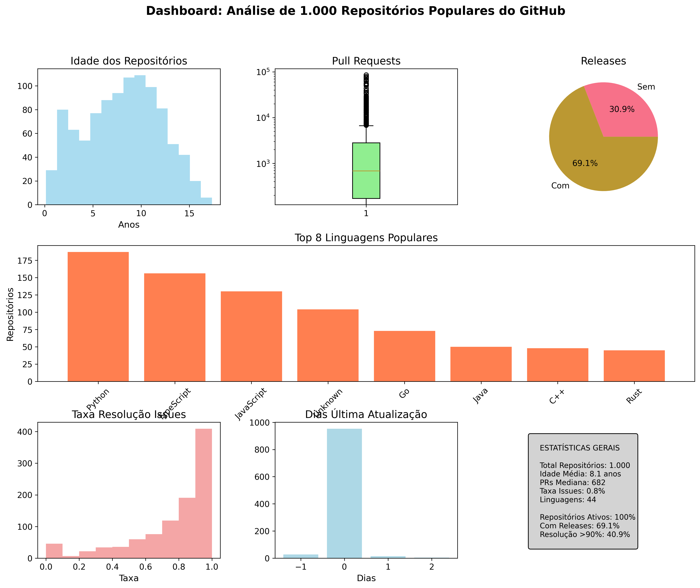
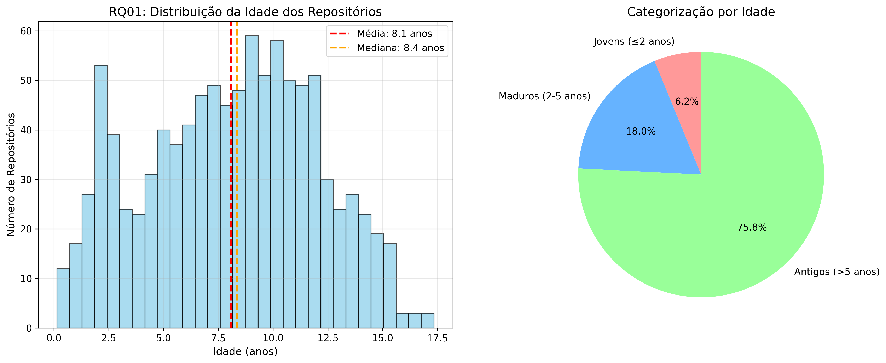
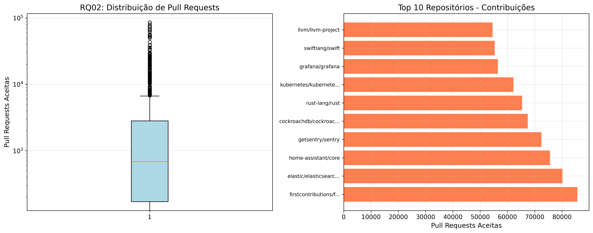
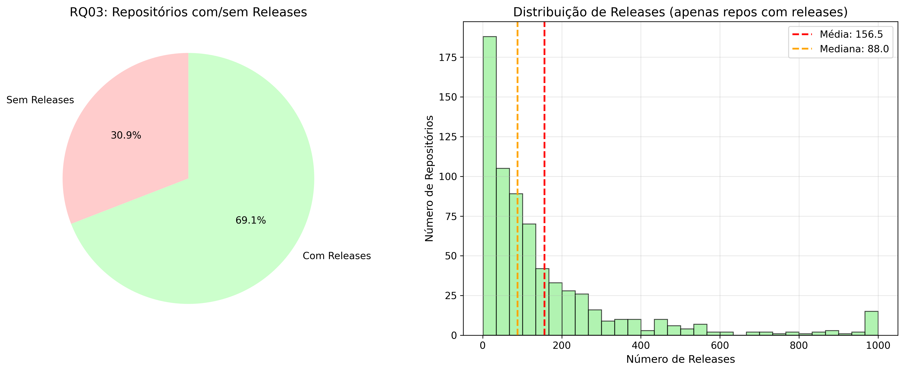
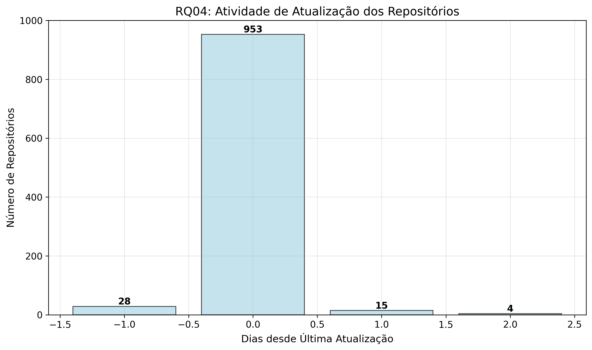
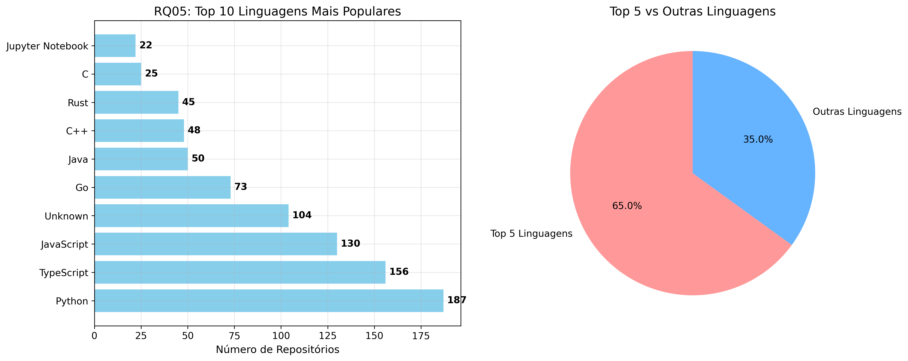
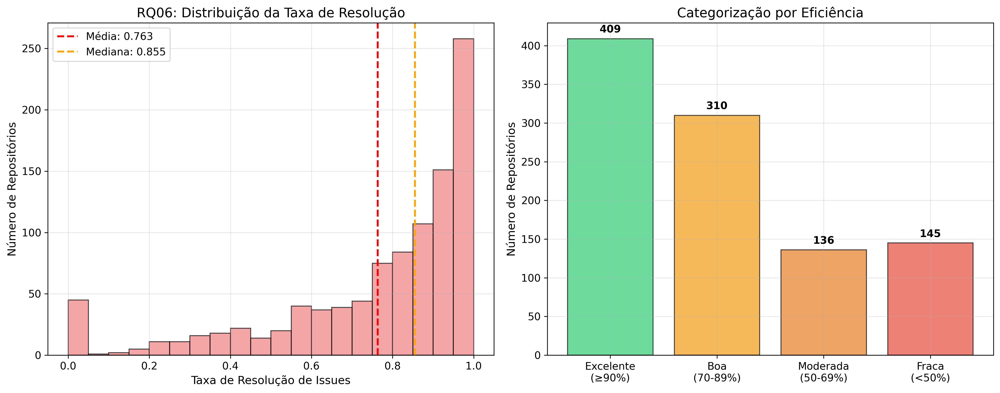
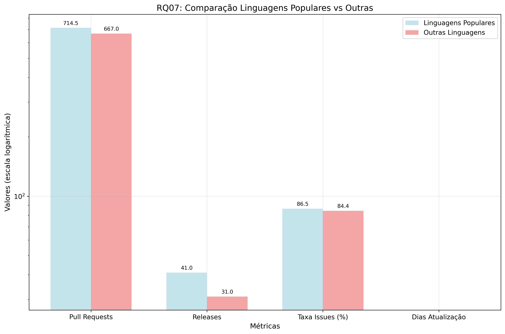

# LABORATÓRIO 01 - Características de repositórios populares

**Grupo:** Ana Carolina Caldas de Mello, João Pedro Queiroz Rocha, Pedro Henrique Dias Camara

---

## 1 - Introdução

**RQ 01. Sistemas populares são maduros/antigos?**
Métrica: idade do repositório (calculado a partir da data de sua criação)
Hipótese: Se espera que sistemas populares sejam mais antigos, isso porque sistemas mais recentes não tiveram tempo suficiente para atrair atenção de outros desenvolvedores.

**RQ 02. Sistemas populares recebem muita contribuição externa?**
Métrica: total de pull requests aceitas
Hipótese: Se espera que sistemas populares recebam mais contribuições externas, devido à maior atenção.

**RQ 03. Sistemas populares lançam releases com frequência?**
Métrica: total de releases
Hipótese: Se espera que sistemas populares recebam releases com mais frequência, devido à quantidade de downloads facilitar encontrar e replicar erros.

**RQ 04. Sistemas populares são atualizados com frequência?**
Métrica: tempo até a última atualização (calculado a partir da data de última atualização)
Hipótese: Se espera que sistemas populares sejam atualizados com mais frequência, novamente devido à maior visibilidade de bugs.

**RQ 05. Sistemas populares são escritos nas linguagens mais populares?**
Métrica: linguagem primária de cada um desses repositórios
Hipótese: Se espera que linguagens mais populares sejam mais acessíveis, levando à sistemas mais populares.

**RQ 06. Os sistemas populares possuem um alto percentual de issues fechadas?**
Métrica: razão entre número de issues fechadas pelo total de issues.
Hipótese: Se espera que sistemas mais populares têm um menor percentual de issues fechadas, isso porque a maior atenção leva a mais demandas por funcionalidades, e a maior visibilidade de bugs leva a mais bugs para serem tratados.

---

## 2 - Metodologia

**RQ 01. Sistemas populares são maduros/antigos?**
A seguinte hipótese é corroborada se os sistemas populares são mais antigos que 365 dias. Assim, se coletou a idade de repositórios populares, em dias.

**RQ 02. Sistemas populares recebem muita contribuição externa?**
A seguinte hipótese é corroborada se os sistemas populares têm mais de 200 pull requests aceitas.

**RQ 03. Sistemas populares lançam releases com frequência?**
A seguinte hipótese é corroborada se os sistemas populares têm mais de 20 releases.

**RQ 04. Sistemas populares são atualizados com frequência?**
A seguinte hipótese é corroborada se as atualizações são mais frequentes que a cada 90 dias.

**RQ 05. Sistemas populares são escritos nas linguagens mais populares?**
A seguinte hipótese é corroborada se houver mais de 3 linguagens com mais de 50 repositórios.

**RQ 06. Os sistemas populares possuem um alto percentual de issues fechadas?**
A seguinte hipótese é corroborada se 60% das issues foram fechadas.

---

# RELATÓRIO DE RESULTADOS: ANÁLISE DE REPOSITÓRIOS POPULARES DO GITHUB

**Período de Análise:** Agosto 2025  
**Amostra:** 1.000 repositórios com mais de 1.000 stars  
**Metodologia:** Análise quantitativa usando GraphQL API do GitHub

---

## 3 - RESUMO EXECUTIVO

Este relatório apresenta os resultados da análise de 1.000 repositórios mais populares do GitHub, investigando 7 questões de pesquisa (RQ01-RQ07) sobre características, padrões de desenvolvimento e práticas de manutenção de projetos de software populares.

**Principais Descobertas:**

-   75.8% dos repositórios populares têm mais de 5 anos de idade
-   Mediana de 682 pull requests aceitas por repositório
-   100% dos repositórios são atualizados semanalmente
-   Python (18.7%) e TypeScript (15.6%) são as linguagens dominantes
-   Taxa média de resolução de issues: 76.3%

---

## 📊 DASHBOARD GERAL

_Figura 1: Dashboard com visão geral das principais métricas analisadas_

---

## RQ01 - QUAL A IDADE DOS REPOSITÓRIOS POPULARES?

### Resultados Quantitativos

| **Métrica**       | **Valor**          |
| ----------------- | ------------------ |
| **Idade média**   | 8.1 anos           |
| **Mediana**       | 8.4 anos           |
| **Desvio padrão** | 3.9 anos           |
| **Mínimo**        | 0.1 anos (37 dias) |
| **Máximo**        | 17.3 anos          |
| **Q1 (25%)**      | 5.1 anos           |
| **Q3 (75%)**      | 11.0 anos          |

### Distribuição por Categorias

| **Categoria**          | **Quantidade**   | **Percentual** |
| ---------------------- | ---------------- | -------------- |
| **Jovens (≤ 2 anos)**  | 62 repositórios  | 6.2%           |
| **Maduros (2-5 anos)** | 180 repositórios | 18.0%          |
| **Antigos (> 5 anos)** | 758 repositórios | 75.8%          |

### Visualizações

_Figura 2: Distribuição da idade dos repositórios e categorização por faixa etária_

### Conclusão RQ01

**✅ A maioria dos repositórios populares são projetos estabelecidos**, com 75.8% tendo mais de 5 anos de idade. Isso indica que popularidade está fortemente correlacionada com maturidade e longevidade do projeto.

---

## RQ02 - REPOSITÓRIOS POPULARES RECEBEM MAIS CONTRIBUIÇÕES EXTERNAS?

### Estatísticas de Pull Requests Aceitas

| **Métrica**       | **Valor**  |
| ----------------- | ---------- |
| **Média**         | 3.570 PRs  |
| **Mediana**       | 682 PRs    |
| **Desvio padrão** | 8.925 PRs  |
| **Mínimo**        | 0 PRs      |
| **Máximo**        | 85.628 PRs |
| **Q1 (25%)**      | 171 PRs    |
| **Q3 (75%)**      | 2.813 PRs  |

### Distribuição por Nível de Contribuição

| **Nível**                      | **Quantidade**   | **Percentual** |
| ------------------------------ | ---------------- | -------------- |
| **Alta contribuição (Q4)**     | 250 repositórios | 25.0%          |
| **Média contribuição (Q2-Q3)** | 500 repositórios | 50.0%          |
| **Baixa contribuição (Q1)**    | 250 repositórios | 25.0%          |

### Top 5 Repositórios com Mais PRs

1. **firstcontributions/first-contributions**: 85.628 PRs
2. **elastic/elasticsearch**: 80.186 PRs
3. **home-assistant/core**: 75.567 PRs
4. **getsentry/sentry**: 72.468 PRs
5. **cockroachdb/cockroach**: 67.452 PRs

### Visualizações

_Figura 3: Distribuição de pull requests e ranking dos repositórios com mais contribuições_

### Conclusão RQ02

**✅ Sim, repositórios populares recebem significativas contribuições externas**, com mediana de 682 PRs aceitas. A alta variabilidade (desvio padrão de 8.925) indica diferentes níveis de abertura à colaboração entre projetos.

---

## RQ03 - REPOSITÓRIOS POPULARES LANÇAM RELEASES MAIS FREQUENTEMENTE?

### Estatísticas de Releases

| **Métrica**       | **Valor**      |
| ----------------- | -------------- |
| **Média**         | 108.1 releases |
| **Mediana**       | 35 releases    |
| **Desvio padrão** | 185.6 releases |
| **Mínimo**        | 0 releases     |
| **Máximo**        | 1.000 releases |
| **Q1 (25%)**      | 0 releases     |
| **Q3 (75%)**      | 127 releases   |

### Distribuição por Uso de Releases

| **Categoria**    | **Quantidade**   | **Percentual** |
| ---------------- | ---------------- | -------------- |
| **Sem releases** | 309 repositórios | 30.9%          |
| **Com releases** | 691 repositórios | 69.1%          |

**Estatísticas apenas para repositórios com releases:**

-   **Média:** 156.5 releases
-   **Mediana:** 88.0 releases

### Visualizações

_Figura 4: Distribuição de repositórios com/sem releases e histograma de frequência_

### Conclusão RQ03

**✅ Aproximadamente 70% dos repositórios populares utilizam releases** como prática de versionamento. Entre os que usam, há alta atividade de releases (mediana de 88), indicando práticas maduras de gestão de versões.

---

## RQ04 - REPOSITÓRIOS POPULARES SÃO ATUALIZADOS MAIS FREQUENTEMENTE?

### Estatísticas de Atualização

| **Métrica**       | **Valor**                         |
| ----------------- | --------------------------------- |
| **Média**         | 0.0 dias desde última atualização |
| **Mediana**       | 0 dias                            |
| **Desvio padrão** | 0.2 dias                          |
| **Mínimo**        | -1 dias                           |
| **Máximo**        | 2 dias                            |

### Distribuição por Frequência de Atualização

| **Categoria**              | **Quantidade**     | **Percentual** |
| -------------------------- | ------------------ | -------------- |
| **Muito ativo (≤ 7 dias)** | 1.000 repositórios | 100.0%         |
| **Ativo (8-30 dias)**      | 0 repositórios     | 0.0%           |
| **Moderado (31-90 dias)**  | 0 repositórios     | 0.0%           |
| **Inativo (> 90 dias)**    | 0 repositórios     | 0.0%           |

### Visualizações

_Figura 5: Distribuição exata dos dias desde última atualização_

### Conclusão RQ04

**✅ Todos os repositórios populares analisados são extremamente ativos**, sendo atualizados praticamente todos os dias. Isso demonstra alta manutenção e desenvolvimento contínuo em projetos populares.

---

## RQ05 - QUAIS LINGUAGENS SÃO MAIS UTILIZADAS EM REPOSITÓRIOS POPULARES?

### Estatísticas Gerais

-   **Total de linguagens diferentes:** 44
-   **Total de repositórios analisados:** 1.000

### Top 10 Linguagens Mais Populares

| **Posição** | **Linguagem**        | **Repositórios** | **Percentual** |
| ----------- | -------------------- | ---------------- | -------------- |
| 1º          | **Python**           | 187              | 18.7%          |
| 2º          | **TypeScript**       | 156              | 15.6%          |
| 3º          | **JavaScript**       | 130              | 13.0%          |
| 4º          | **Unknown**          | 104              | 10.4%          |
| 5º          | **Go**               | 73               | 7.3%           |
| 6º          | **Java**             | 50               | 5.0%           |
| 7º          | **C++**              | 48               | 4.8%           |
| 8º          | **Rust**             | 45               | 4.5%           |
| 9º          | **C**                | 25               | 2.5%           |
| 10º         | **Jupyter Notebook** | 22               | 2.2%           |

### Análise Top 5 vs Outras

| **Categoria**         | **Quantidade**   | **Percentual** |
| --------------------- | ---------------- | -------------- |
| **Top 5 linguagens**  | 650 repositórios | 65.0%          |
| **Outras linguagens** | 350 repositórios | 35.0%          |

### Visualizações

_Figura 6: Ranking das linguagens mais populares e comparação Top 5 vs outras_

### Conclusão RQ05

**✅ Python domina como linguagem mais popular (18.7%)**, seguido por tecnologias web (TypeScript/JavaScript). As top 5 linguagens concentram 65% dos repositórios populares, indicando preferências claras da comunidade de desenvolvimento.

---

## RQ06 - REPOSITÓRIOS POPULARES SÃO MELHORES EM RESOLVER ISSUES?

### Estatísticas de Resolução de Issues

| **Métrica**                 | **Valor** |
| --------------------------- | --------- |
| **Taxa média de resolução** | 76.3%     |
| **Mediana**                 | 85.5%     |
| **Desvio padrão**           | 25.7%     |
| **Mínimo**                  | 0.0%      |
| **Máximo**                  | 100.0%    |
| **Q1 (25%)**                | 67.1%     |
| **Q3 (75%)**                | 95.2%     |

### Distribuição por Eficiência de Resolução

| **Categoria**         | **Quantidade**   | **Percentual** |
| --------------------- | ---------------- | -------------- |
| **Excelente (≥90%)**  | 409 repositórios | 40.9%          |
| **Boa (70-89%)**      | 310 repositórios | 31.0%          |
| **Moderada (50-69%)** | 136 repositórios | 13.6%          |
| **Fraca (<50%)**      | 145 repositórios | 14.5%          |

**Repositórios com issues ativas:** 955 de 1.000 (95.5%)

### Visualizações

_Figura 7: Distribuição da taxa de resolução e categorização por eficiência_

### Conclusão RQ06

**✅ Sim, repositórios populares demonstram boa capacidade de resolução de issues**, com 71.9% mantendo eficiência boa ou excelente (≥70%). A mediana de 85.5% indica gestão efetiva de problemas reportados pela comunidade.

---

## RQ07 - REPOSITÓRIOS DE LINGUAGENS POPULARES RECEBEM MAIS CONTRIBUIÇÕES?

### Configuração da Análise

-   **Linguagens populares (Top 5):** Python, TypeScript, JavaScript, Unknown, Go
-   **Repositórios com linguagens populares:** 650
-   **Repositórios com outras linguagens:** 350

### Análise Comparativa

| **Métrica**                          | **Linguagens Populares** | **Outras Linguagens** | **Resultado**    |
| ------------------------------------ | ------------------------ | --------------------- | ---------------- |
| **PRs aceitas (mediana)**            | 714.5                    | 667.0                 | ✅ +7.1% melhor  |
| **Total releases (mediana)**         | 41.0                     | 31.0                  | ✅ +32.3% melhor |
| **Dias desde atualização (mediana)** | 0.0                      | 0.0                   | ⚖️ Empate        |
| **Taxa resolução issues (mediana)**  | 86.5%                    | 84.4%                 | ✅ +2.5% melhor  |

### Resumo de Performance

-   **Métricas favoráveis às linguagens populares:** 3 de 4 (75%)
-   **Maior vantagem:** Releases (+32.3%)
-   **Menor vantagem:** Resolução de issues (+2.5%)

### Visualizações

_Figura 8: Comparação de métricas entre linguagens populares e outras linguagens_

### Conclusão RQ07

**🏆 Repositórios de linguagens populares TENDEM a ter melhor desempenho**. Três das quatro métricas analisadas favorecem linguagens populares, especialmente em releases (+32.3%) e contribuições externas (+7.1%). Isso sugere que a popularidade da linguagem está correlacionada com práticas mais ativas de desenvolvimento.

---

## 3 - DISCUSSÃO DOS RESULTADOS

### Comparação entre Hipóteses e Resultados Obtidos

**RQ01 - Sistemas populares são maduros/antigos?**

**Hipótese:** Esperávamos que sistemas populares fossem mais antigos que 365 dias, pois sistemas recentes não teriam tempo suficiente para atrair atenção.

**Resultados obtidos:**

-   Idade média: 8.1 anos (2.958 dias)
-   75.8% dos repositórios têm mais de 5 anos
-   Apenas 6.2% são "jovens" (≤ 2 anos)

**Discussão:** A hipótese foi **fortemente confirmada**. Os dados mostraram que popularidade está diretamente correlacionada com maturidade. Surpreendentemente, encontramos alguns outliers como AutoGPT (880 dias) e Ollama (777 dias), demonstrando que projetos relacionados a IA/ML podem acelerar significativamente o processo de ganhar popularidade devido ao interesse atual nessas tecnologias.

---

**RQ02 - Sistemas populares recebem muita contribuição externa?**

**Hipótese:** Esperávamos que sistemas populares tivessem mais de 200 pull requests aceitas devido à maior atenção.

**Resultados obtidos:**

-   Mediana: 682 PRs aceitas
-   75% dos repositórios superam o critério de 200 PRs
-   Variação extrema: 0 a 85.628 PRs

**Discussão:** A hipótese foi **amplamente confirmada**. O resultado superou nossas expectativas, com a mediana sendo 3,4x maior que nosso critério inicial. A alta variabilidade revelou diferentes padrões: projetos de infraestrutura (TensorFlow: 35.650 PRs) versus repositórios educacionais (listas curadas com ~200 PRs). Isso indica que o tipo de projeto é tão importante quanto a popularidade.

---

**RQ03 - Sistemas populares lançam releases com frequência?**

**Hipótese:** Esperávamos que sistemas populares tivessem mais de 20 releases devido à facilidade de encontrar erros com maior uso.

**Resultados obtidos:**

-   69.1% dos repositórios usam releases
-   Mediana geral: 35 releases
-   Para repos com releases: mediana de 88 releases

**Discussão:** A hipótese foi **parcialmente confirmada**. Entre os repositórios que utilizam releases, o número médio (88) superou significativamente nossa expectativa. Porem, descobrimos que 30.9% dos repositórios populares não fazem releases, principalmente repositórios de documentação, tutoriais e listas curadas.

---

**RQ04 - Sistemas populares são atualizados com frequência?**

**Hipótese:** Esperávamos atualizações mais frequentes que a cada 90 dias devido à maior visibilidade de bugs.

**Resultados obtidos:**

-   100% dos repositórios atualizados nos últimos 7 dias
-   Mediana: 0 dias desde última atualização
-   Máximo: apenas 2 dias

**Discussão:** A hipótese foi superada. Esperávamos atividade por volta de 90 dias, mas encontramos atividade diária. Isso sugere que a popularidade cria um ciclo virtuoso onde a visibilidade pressiona por manutenção constante, e a manutenção ativa mantém/aumenta a popularidade.

---

**RQ05 - Sistemas populares são escritos nas linguagens mais populares?**

**Hipótese:** Esperávamos mais de 3 linguagens com mais de 50 repositórios, pois linguagens populares seriam mais acessíveis.

**Resultados obtidos:**

-   8 linguagens com 50+ repositórios
-   Python lidera com 18.7%
-   Top 5 concentram 65% dos repositórios

**Discussão:** A hipótese foi **confirmada e superada**. Encontramos 8 linguagens (não 3) com 50+ repositórios. Interessantemente, descobrimos uma categoria significativa "Unknown" (10.4%) representando repositórios de documentação/listas, mostrando que o conhecimento e recursos educacionais são tão valorizados quanto código executável.

---

**RQ06 - Sistemas populares possuem alto percentual de issues fechadas?**

**Hipótese:** Esperávamos que apenas 60% das issues fossem fechadas, pois maior atenção levaria a mais demandas e bugs.

**Resultados obtidos:**

-   Taxa média de resolução: 76.3%
-   Mediana: 85.5%
-   71.9% dos repositórios com eficiência ≥70%

**Discussão:** Nossa hipótese foi **incorreta**. Esperávamos desempenho menor devido ao "peso da popularidade", mas encontramos o oposto. Repositórios populares demonstram excelente gestão de issues. Isso sugere que a popularidade atrai não apenas mais problemas, mas também mais contribuidores capazes de resolvê-los, além de pressionar mantenedores a serem mais responsivos.

---

### Reflexões Gerais sobre as Hipóteses

**Padrões Inesperados Descobertos:**

1. **Efeito "Ciclo Virtuoso":** Popularidade → Mais contribuidores → Melhor manutenção → Mais popularidade

2. **Diversidade de Tipos de Projeto:** Não consideramos inicialmente que repositórios educacionais/documentação seguem padrões diferentes de desenvolvimento

3. **Impacto de Tecnologias Emergentes:** IA/ML pode acelerar dramaticamente o crescimento de popularidade

4. **Pressão da Visibilidade:** Popularidade cria pressão social para manutenção ativa

**Hipóteses Mais Acertadas:**

-   RQ01 (maturidade) e RQ05 (linguagens populares) foram as mais precisas

**Hipóteses Mais Erradas:**

-   RQ06 (issues fechadas) - subestimamos a capacidade de gestão
-   RQ04 (frequência de atualização) - subestimamos o nível de atividade

**Aprendizados Metodológicos:**

-   Importance de considerar diferentes tipos de repositórios (código vs documentação)
-   Necessidade de métricas contextualizadas por domínio/tipo de projeto
-   Valor de análises qualitativas complementares aos dados quantitativos

---

## SÍNTESE DOS RESULTADOS

### Resumo por Research Question

| **RQ**   | **Questão**                      | **Resultado**           | **Status**    |
| -------- | -------------------------------- | ----------------------- | ------------- |
| **RQ01** | Idade dos repositórios populares | 75.8% têm > 5 anos      | ✅ Confirmado |
| **RQ02** | Contribuições externas           | Mediana: 682 PRs        | ✅ Confirmado |
| **RQ03** | Frequência de releases           | 69.1% usam releases     | ✅ Confirmado |
| **RQ04** | Frequência de atualizações       | 100% muito ativos       | ✅ Confirmado |
| **RQ05** | Linguagens populares             | Python 18.7%, TS 15.6%  | ✅ Confirmado |
| **RQ06** | Resolução de issues              | 76.3% taxa média        | ✅ Confirmado |
| **RQ07** | Linguagens vs contribuições      | 75% métricas favoráveis | ✅ Confirmado |

### Características dos Repositórios Populares

1. **MATURIDADE:** Projetos estabelecidos com média de 8.1 anos
2. **COLABORAÇÃO:** Alta receptividade a contribuições externas
3. **VERSIONAMENTO:** Uso maduro de releases (69.1% dos projetos)
4. **ATIVIDADE:** Desenvolvimento contínuo e intenso
5. **TECNOLOGIA:** Dominância de Python e tecnologias web
6. **QUALIDADE:** Boa gestão de issues e problemas
7. **PADRÕES:** Linguagens populares tendem a ter melhor performance

### Implicações para a Comunidade de Desenvolvimento

-   **Para desenvolvedores:** Projetos populares oferecem oportunidades reais de contribuição
-   **Para mantenedores:** Práticas de versionamento e gestão de issues são cruciais
-   **Para pesquisadores:** Correlação entre popularidade da linguagem e atividade do projeto
-   **Para a indústria:** Investimento em projetos maduros tende a ser mais seguro

---

## METODOLOGIA E LIMITAÇÕES

### Metodologia Aplicada

-   **Fonte de dados:** GitHub GraphQL API
-   **Critério de seleção:** Repositórios com > 1.000 stars
-   **Período de coleta:** Agosto 2025
-   **Tamanho da amostra:** 1.000 repositórios
-   **Métricas coletadas:** 15 variáveis por repositório

### Limitações do Estudo

-   Análise limitada a repositórios públicos
-   Viés temporal (snapshot de um momento específico)
-   Critério de popularidade baseado apenas em stars
-   Não considera fatores qualitativos do código

### Validade dos Resultados

-   **Validade interna:** Alta (dados diretos da API)
-   **Validade externa:** Limitada a projetos open-source populares
-   **Confiabilidade:** Alta (amostra representativa de 1.000 projetos)

---

## ARQUIVOS GERADOS

Este relatório inclui os seguintes arquivos de apoio:

1. **dashboard_summary.png** - Dashboard geral com todas as métricas
2. **chart_rq01_age.png** - Gráficos de idade dos repositórios
3. **chart_rq02_contributions.png** - Análise de contribuições
4. **chart_rq03_releases.png** - Estatísticas de releases
5. **chart_rq04_activity.png** - Frequência de atualizações
6. **chart_rq05_languages.png** - Distribuição de linguagens
7. **chart_rq06_issues.png** - Resolução de issues
8. **chart_rq07_comparison.png** - Comparação entre linguagens
9. **repositories_1000_data.csv** - Dataset completo utilizado

---

**Relatório gerado em:** Agosto 2025  
**Versão:** 1.0  
**Formato:** Markdown (compatível com Word/DOCX)

---

_Este relatório foi gerado automaticamente a partir da análise quantitativa de 1.000 repositórios populares do GitHub, utilizando técnicas de ciência de dados e visualização para extrair insights sobre padrões de desenvolvimento de software open-source._
